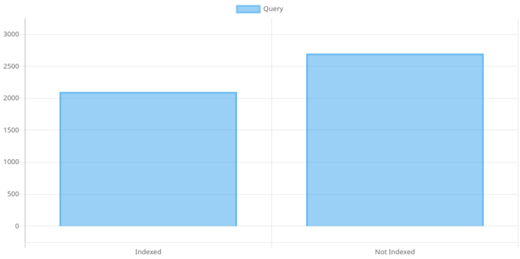
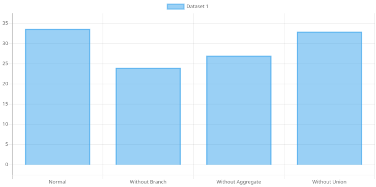
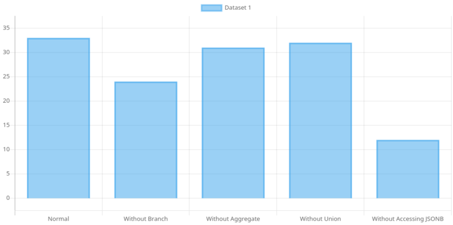
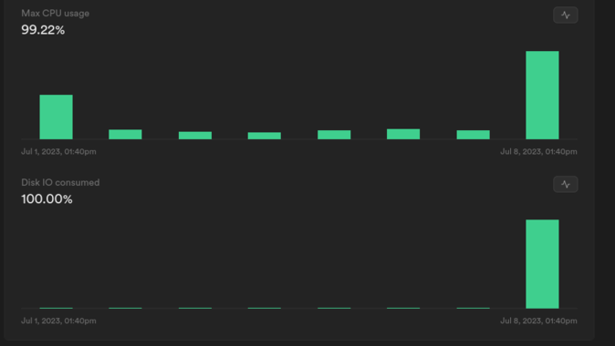

The dramatic story (not really) of coping with postgre performance

## The simplicity mirage

On the 11th of April 2023, a seemingly harmless feature request was thrown into the mix. The team wanted the ability to export sales reports within a specific date range. "Piece of cake," I thought confidently. After all, we already had the daily export feature in place. How hard could it be to add a date filter and call it a day?


Our first attempt at tackling this feature seemed promising. Just add a second date filter and voila! But oh boy, did we get a rude awakening. As soon as we dared to request a month-long sales report, the query simply timed out...

There must be a mistake let's try it again!

`Cancelling statement due to statement timeout`

Uhh... Let's try the Supabase sql editor and run the query there

`upstream request timeout`


The Math isn't Mathing! I mean, come on, if it takes less than a second to fetch the sales for a single day, logic dictates that a month's worth of data would take, what, 30 seconds max?

Instead of unraveling the enigma at that moment, we collectively decided to take the easy way out and increase the timeout limit. And like magic, we could finally export a month's worth of reports. Victory! Or so we thought... The feature can only handle 1 month worth of report max


## Taming the elephant

After putting the feature on the back burner and juggling other priorities and projects, I finally mustered the courage to confront the infamous sales report conundrum once again. Determined to find a permanent solution, I dove headfirst into data query.

Upon examining the current implementation, it became painfully clear that it was ill-equipped to handle anything beyond a measly month of data. As I peered into the depths of the report data view, a sinking feeling washed over me.

```sql
CREATE OR REPLACE VIEW public."laporanPenjualanDetailNew"
 AS
( SELECT r.id,
    r."isDeleted",
    s.id AS "salesId",
    s.name AS "salesName",
    s.division AS "salesDivision",
    s."clusterId",
    c.name AS "clusterName",
    o.id AS "outletId",
    o."digiposId",
    o.name AS "outletName",
    o."noChip" AS "outletNoChip",
    w."uniqueId" AS "itemOrProgramId",
        CASE
            WHEN rd."programId" IS NOT NULL THEN 'Program'::text
            ELSE 'Fisik'::text
        END AS "typeItem",
    replace(
        CASE
            WHEN rd."programId" IS NOT NULL THEN (rd.program -> 'name'::text)::text
            ELSE (rd.item -> 'name'::text)::text
        END, '"'::text, ''::text) AS "itemName",
    count(rd.id) AS "countItem",
        CASE
            WHEN rd."programId" IS NOT NULL THEN (rd.program -> 'priceProgram'::text)::double precision
            ELSE (rd.item -> 'basePrice'::text)::double precision
        END AS "priceBase",
        CASE
            WHEN rd."programId" IS NOT NULL THEN (rd.program -> 'price'::text)::double precision
            ELSE (rd.item -> 'price'::text)::double precision
        END AS "priceSell",
    sum(
        CASE
            WHEN rd."programId" IS NOT NULL THEN (rd.program -> 'priceProgram'::text)::double precision
            ELSE (rd.item -> 'basePrice'::text)::double precision
        END) AS "priceBaseTotal",
    sum(
        CASE
            WHEN rd."programId" IS NOT NULL THEN (rd.program -> 'price'::text)::integer
            ELSE (rd.item -> 'price'::text)::integer
        END) AS "priceSellTotal",
    sum(
        CASE
            WHEN rd."programId" IS NOT NULL THEN (rd.program -> 'price'::text)::integer
            ELSE (rd.item -> 'price'::text)::integer
        END)::double precision - sum(
        CASE
            WHEN rd."programId" IS NOT NULL THEN (rd.program -> 'price'::text)::integer::double precision - (rd.program -> 'margin'::text)::double precision
            ELSE (rd.item -> 'basePrice'::text)::integer::double precision
        END) AS laba,
    to_char((
        CASE
            WHEN r."updatedAt" IS NULL THEN r."createdAt"
            ELSE r."updatedAt"
        END AT TIME ZONE 'ASIA/JAKARTA'::text)::date::timestamp with time zone, 'yyyyMMdd'::text)::integer AS "dateInt",
    to_char((
        CASE
            WHEN r."updatedAt" IS NULL THEN r."createdAt"
            ELSE r."updatedAt"
        END AT TIME ZONE 'ASIA/JAKARTA'::text)::date::timestamp with time zone, 'yyyy-MM-dd'::text) AS date,
    (r."createdAt" AT TIME ZONE 'ASIA/JAKARTA'::text) AS "createdAt",
    w."uniqueId"
   FROM "receiptDetails" rd,
    receipts r,
    "masterSales" s,
    "masterClusters" c,
    "masterOutlets" o,
    "warehouseStocks" w
  WHERE r.id = rd."receiptId" AND r."isDeleted" = false AND rd."isDeleted" = false AND w."serialNumber" = rd."serialNumber" AND s.id = r."salesId" AND o.id = r."outletId" AND c.id = s."clusterId"
  GROUP BY w."uniqueId", s.id, r.id, (
        CASE
            WHEN rd."programId" IS NOT NULL THEN 'Program'::text
            ELSE 'Fisik'::text
        END), (replace(
        CASE
            WHEN rd."programId" IS NOT NULL THEN (rd.program -> 'name'::text)::text
            ELSE (rd.item -> 'name'::text)::text
        END, '"'::text, ''::text)), (
        CASE
            WHEN rd."programId" IS NOT NULL THEN (rd.program -> 'priceProgram'::text)::double precision
            ELSE (rd.item -> 'basePrice'::text)::double precision
        END), (
        CASE
            WHEN rd."programId" IS NOT NULL THEN (rd.program -> 'price'::text)::double precision
            ELSE (rd.item -> 'price'::text)::double precision
        END), (to_char((
        CASE
            WHEN r."updatedAt" IS NULL THEN r."createdAt"
            ELSE r."updatedAt"
        END AT TIME ZONE 'ASIA/JAKARTA'::text)::date::timestamp with time zone, 'yyyy-MM-dd'::text)), r."createdAt", c.id, o.id
  ORDER BY r.id)
UNION
( SELECT r.id,
    r."isDeleted",
    s.id AS "salesId",
    s.name AS "salesName",
    s.division AS "salesDivision",
    s."clusterId",
    c.name AS "clusterName",
    o.id AS "outletId",
    o."digiposId",
    o.name AS "outletName",
    o."noChip" AS "outletNoChip",
    'LA'::text AS "itemOrProgramId",
    'LA'::text AS "typeItem",
    'LA'::text AS "itemName",
    0 AS "countItem",
    0 AS "priceBase",
    0 AS "priceSell",
    0 AS "priceBaseTotal",
    r.cash + r.bni + r.bri + r.bca + r.mandiri AS "priceSellTotal",
    0 AS laba,
    to_char((
        CASE
            WHEN r."updatedAt" IS NULL THEN r."createdAt"
            ELSE r."updatedAt"
        END AT TIME ZONE 'ASIA/JAKARTA'::text)::date::timestamp with time zone, 'yyyyMMdd'::text)::integer AS "dateInt",
    to_char((
        CASE
            WHEN r."updatedAt" IS NULL THEN r."createdAt"
            ELSE r."updatedAt"
        END AT TIME ZONE 'ASIA/JAKARTA'::text)::date::timestamp with time zone, 'yyyy-MM-dd'::text) AS date,
    (r."createdAt" AT TIME ZONE 'ASIA/JAKARTA'::text) AS "createdAt",
    ''::text AS "uniqueId"
   FROM receipts r
     JOIN "masterSales" s ON s.id = r."salesId" AND r."isDeleted" = false
     JOIN "masterClusters" c ON c.id = s."clusterId"
     JOIN "masterOutlets" o ON o.id = r."outletId"
  WHERE r.type = 'Top Up'::text
  ORDER BY r.id)
  ORDER BY 21 DESC;
```

It was a tangled web of complexity, a union of two queries, adorned with branching conditions, spanning across five tables with thousands upon thousands of records. Good grief! Where on earth does one even begin to untangle this intricate mess?


You see, the App relies on Supabase as its trusty database provider, with PostgreSQL doing all the heavy lifting behind the scenes. Now, I must confess that while I know a thing or two in NoSQL databases like Firebase, I lack the hours to tackle the world of SQL databases, especially on this scale.

Realizing my lack of understanding in PostgreSQL and feeling completely lost, I knew I had to get up to speed quickly. So, for the next two nights, I dived into the PostgreSQL documentation headfirst. Although I didn't read every single page, I made sure to grasp the most important concepts and get a good grasp of where to begin.

With each section I read, PostgreSQL started to make more sense. I learned about indexing strategies, vacuuming, and the basics of query optimization. It was like finding puzzle pieces that helped me see the bigger picture.

After my intensive (not really) reading session, I felt more confident. While there was still much to learn, I now had a solid starting point. I was ready to take on the challenge armed with my newfound PostgreSQL knowledge.


## Finding half of the solution: Index

Alright, it's time to face the cold, hard truth. Brace yourselves, SQL experts, because here comes the confession: we weren't using indexes. I can almost hear the collective gasps and facepalms echoing in the distance. In my blissful ignorance, I thought everything was hunky-dory.

But let's take a moment to understand the significance of indexes. They play a crucial role in optimizing queries. The table is a book without an index you flip through the entire book to find what you're looking for with an index it looks like this:


To illustrate the importance of indexes, let's dive into some charts. These charts depict the speed gains achieved after implementing indexes. Prepare to be amazed!



Smaller is better

Voila! With the power of indexes, we managed to save a whopping 4 seconds! Now, I know it may not sound like much in the grand scheme of things, but in the world of database queries, that's a significant improvement.

When we used the magical explain analyze command on our query, we witnessed a remarkable transformation. Gone were the days of the dreaded sequential scan where PostgreSQL painstakingly sifted through every page of the book. Instead, we now basked in the glory of the index scan on xx a sight that filled our hearts with joy. It was a clear indication that our indexes were being put to good use.

However, despite our valiant efforts and the progress we had made, we were not out of the woods just yet. As we prepared to run our export feature, a dark cloud of dread loomed overhead. The haunting specter of the "Cancelling statement due to statement timeout" still haunted us like a persistent ghost. It seemed like our 4-second victory was simply not enough to banish this relentless foe.

## Finding impostor among us

With no other options left, I had to roll up my sleeves and get my hands dirty with the query itself. It was time to play detective and identify the culprit responsible for the sluggish execution time. Was it the sneaky union causing trouble? Or maybe the complex branching logic? Perhaps the seemingly innocent aggregate function had a hidden agenda?

In my pursuit of answers, I embarked on a process of elimination. Similar to a game of deduction, I had to eliminate suspects one by one until I found the true culprit. Unlike in "Among Us," where ejecting the wrong crewmate results in failure, here it was a matter of narrowing down the possibilities and uncovering the source of our woes.


After conducting intense investigations and pouring over the data, the results were finally in. Behold, the revealing chart that held the key to our query performance:



It became glaringly obvious that the culprit behind the sluggish execution was the branching logic. However, something still felt fishy. It struck me that when I removed the branch, I also eliminated access to certain columns, particularly those with the jsonb data type. This discovery prompted a daring experiment: what if we completely removed the jsonb data?

I executed the altered query and watched as the seconds ticked away. And then, the query time plummeted from 33 seconds to a mere 12 seconds. A massive improvement, indeed! It seemed like the solution was within reach, just remove the jsonb and call it a day. But alas, life is never that simple.



Here's where the dilemma set in. The jsonb data was crucial to our operations. It allowed us to store item data at the time of the transaction, ensuring that any future changes to the item's price wouldn't affect the report. Removing it entirely was not an option. So, what were we to do now? Despite our deliberate efforts, we seemed trapped in a conundrum with no apparent way out.


But let's not lose hope just yet. It's said that in the face of adversity, innovation thrives. Perhaps, just perhaps, a glimmer of a solution awaited us, ready to be discovered and embraced.

## A glimmer of hope

Confronted with the harsh reality that improving the existing query was a near-impossible task, I shifted my focus towards finding a way to work around this limitation. A potential solution emerged in my mind: why not offload the export generation to an asynchronous service running on a separate server? By doing so, even if the process took longer, users could simply check back later and continue using the app without waiting for the export to finish.

For the backend server, I opted to use Rust.


Not because I wanted to evangelize or squeeze every ounce of performance, but rather because I knew that Rust's async runtime, Tokioooooo, offered a hassle-free way to create and spawn asynchronous processes. It seemed like a fitting choice for the task at hand.

```rust
actix_web::rt::spawn(async move {
    // async process here
})
// it's literally that simple
```

I started building the API service in Rust, praying that this approach would finally prove successful. Before long, I completed the first iteration of the service and put it to the test. Miraculously, it worked!


I could now export more than a single month's worth of data. I pushed the boundaries and tested it with five months' worth of data, and it performed admirably. There was no reason to believe that I couldn't scale it further.

However, as is often the case in our journey, my elation was short-lived. I soon discovered that the chance of timeouts and failures still loomed over the process, occurring more often than I had hoped. The initial victory was dampened by this realization, leaving me once again in search of a solution to this persistent challenge...

## Work around that took out production

In my quest to overcome the timeouts and failures, I devised a workaround. First, I resorted to an extreme measure by increasing the timeout to a whopping 5000 seconds!!!

As for the Rust implementation, I set it up to retry the request if no response was received within 4 minutes.

```rust
while is_success == false {
    let count = client.get("URL").timeout(std::time::Duration::new(240, 0)).send().await;
    match count {
        Ok(expr) => {
            is_success = true;
        }
        Err(_) => {
            println!("timed out, retrying");
            continue;
        }
    }
}
```

Little did I know that this plan would lead to catastrophic consequences and bring production to a screeching halt.

After implementing the changes, I ran the system and decided to take a well-deserved lunch break. Upon returning, I anxiously checked the logs, only to discover that the retries were indeed happening. Progress, albeit slow, was being made. However, my relief was short-lived. Half an hour later, an alarming message arrived, notifying me that production was unresponsive.


To my horror, I found the database in an unresponsive state. CPU usage and disk I/O bandwidth were pushed to their limits. It became apparent that the sheer size of our query required PostgreSQL to temporarily store data on the disk and read it back later. With my incessant retries, without cancelling prior requests, the database was bombarded with an astronomical number of reads and writes, leading to its downfall.



Swiftly, I terminated all connections to the database, restoring order and stability. However, the bandwidth for that day was a casualty of the chaos. Frustration bubbled within me, yet I was determined to return to the drawing board once more.

## Discovering Success: The Silver Lining

After enduring a grueling amount of trial and error, I finally devised a new plan to tackle the persistent timeout issue. The key was to segment the request into a maximum of one month per request. For example, if a user requested a five-month-long report, I would split it into five separate one-month requests and send them to the database.

```rust
fn split_date_range(start_date: &str, end_date: &str) -> Vec<DateRange> {
    let start_date = NaiveDate::parse_from_str(start_date, "%Y-%m-%d").unwrap();
    let end_date = NaiveDate::parse_from_str(end_date, "%Y-%m-%d").unwrap();

    let mut split_dates = Vec::new();
    let mut current_date = start_date;

    while current_date < end_date {
        let next_month_start = current_date
            .with_day(1)
            .unwrap()
            .with_month(current_date.month() + 1)
            .unwrap();
        let split_end_date = if next_month_start <= end_date {
            next_month_start - chrono::Duration::days(1)
        } else {
            end_date
        };

        let date_range = DateRange {
            start_date: current_date.to_string(),
            end_date: split_end_date.to_string(),
        };
        split_dates.push(date_range);

        current_date = next_month_start;
    }
    split_dates
}
```

But why this segmentation, you may wonder?

Well, the root cause of the timeouts lay in my initial approach of requesting the exact count of rows for each individual request. This proved to be a costly operation in PostgreSQL, taking longer than fetching the actual data itself. To make matters worse, I was repeatedly requesting the count, multiplying the impact. It dawned on me that by reducing the amount of data requested, the count operation would be significantly faster. It was a hypothesis worth testing.

With cautious optimism, I implemented the segmentation approach, and lo and behold, it worked! Even when requesting data from the very beginning of the app until the current date, the system performed admirably. Granted, it may still be considered slow, but compared to the previous state of perpetual timeouts, delivering five months' worth of data in just two minutes was a considerable improvement. From infinity to two minutes, I'd say that's more than decent progress.

With my newfound solution in hand, I confidently deployed and tested it in the production environment. And you know what? It worked flawlessly. After an arduous journey filled with countless setbacks, I had finally found the light at the end of the tunnel.


## Conclusion

It has been a puzzling battle, but one that was fought valiantly, if I may say so myself. This blog post only scratches the surface of what I learned throughout this feature request journey. In reality, the lessons were far more extensive and intricate. However, fear not, for I plan to delve into those details in a separate post, providing a deeper exploration of the knowledge gained. For now, let this post serve as an amusing tale of taming the elephant.

In hindsight, it's clear that better table design could have avoided many of the challenges we faced. But compromises are often inevitable, and requirements tend to change. If only we had known the precise report style from the very beginning, we could have designed more performant tables. Alas, what's done is done, and a total rewrite is rarely the optimal solution. Sometimes, we must repair a flat tire on a moving car, a difficult task indeed. Yet, with determination and effort, we can overcome the hurdles and find a way forward.

In the end, this experience has been a valuable lesson in problem-solving and resilience. It reminded me that even in the face of seemingly insurmountable obstacles, there is always a path to a solution. It may require creativity, perseverance, and a healthy dose of humor, but with these tools in hand, we can triumph over the most formidable challenges. So, onward we go, armed with newfound knowledge and a spirit ready to conquer whatever the future may bring.
