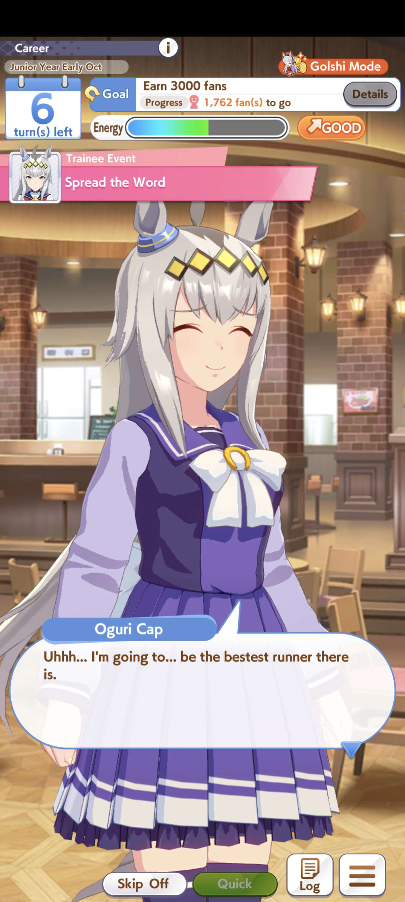
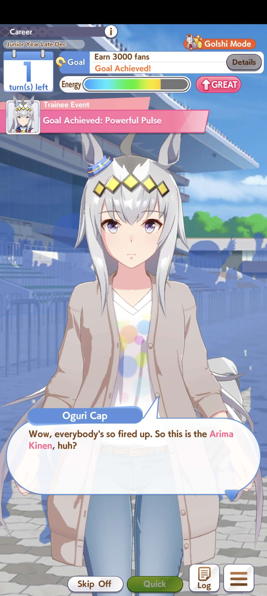
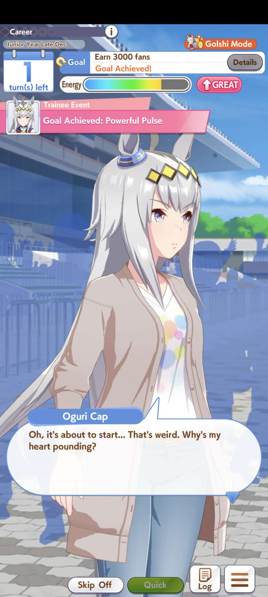
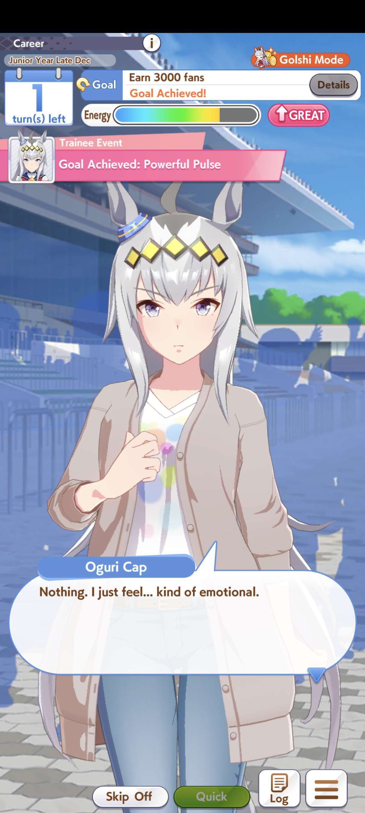
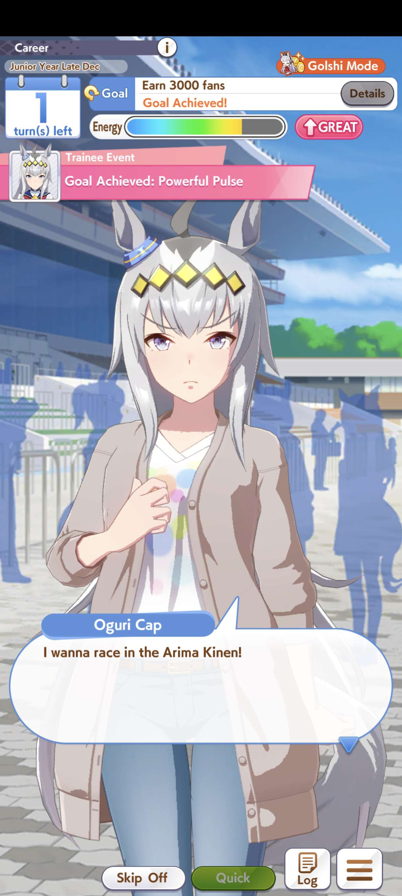

Arima Kinen should be a rather familiar words after the recent horse craze due to the hit game uma musume: pretty derby.

For the uninitiated Arima Kinen is a Grade 1 horse race held in Nakayama Racecourse in Japan. For the purpose of this article it is simply a prestigious and popular race, only horses with enough fan votes or prize money won could participate.

But, this article is about the horses from the game Uma Musume and not the real world counterpart.

## The Horse Runs
The Uma Musumes are born to run, that much is very clear, it has been the one fact that is established before every anime or game starts.

But soon, each of them is faced with a deeper question: how do they run? With whom do they run? And most importantly, why do they run in the first place?

Some find their answer quickly. Some struggle. For others, the act of running itself feels like enough, why bother seeking a purpose when the act of running itself already feels like a blessing?

## Oguri Cap
This fatty needs no introduction, loved by everyone and she have her own anime!1!1 (go watch Cinderella Gray). She might be a glutton and seems to be afloat sometimes. However, when it comes to racing she transforms into a force of nature.

Her speed and power is nothing to scoff at, she isn't demolishing monthly cafeteria supply for nothing.   
Win after win, she seems unstoppable  
"run a lot, eat a lot, and then all that's left is... sleep a lot."

But when asked why she runs, Oguri struggles. Strength alone isn’t enough, she lacks a clear reason. And though her talent carries her, something feels incomplete.

She started to slowly discover her reason, this search for purpose was solidified when she witnesses the Arima Kinen.

No grand explanation is needed. Watching the race stirs something indescribable, emotional, heart-pounding, undeniable. In that moment, her resolve crystallizes:  

To become the strongest.  
To make her supporters proud.  
To one day run in the Arima Kinen herself.  

## Your Arima Kinen
This isn’t about telling you to watch the Arima Kinen. It’s about bearing witness to the pinnacle of what you care about.  

Whether it’s a competition, a masterpiece, or a finished piece of work, it doesn’t matter. What matters is seeing it at its highest form.  

Because when you’re uncertain, when your own pursuit of mastery feels shaky, witnessing others give everything at their peak can reignite something in you.  
